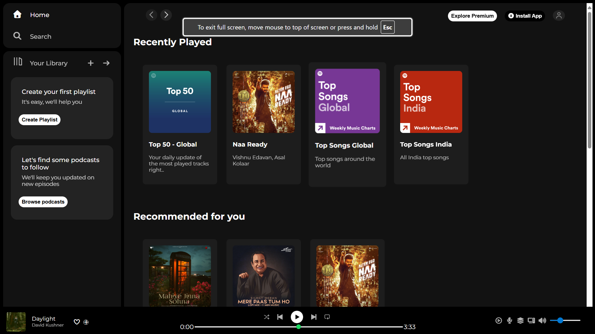

# 🎵 Spotify Frontend Clone (HTML + CSS)

This is a **Spotify Frontend Clone** created using only **HTML** and **CSS**.  
It replicates the user interface of Spotify’s web player, including the sidebar, playlists, and music card layouts.

---

## 🚀 Features
- 🎶 Spotify-inspired design  
- 🎨 Styled with pure **CSS** (no frameworks used)  
- 📱 Responsive layout for desktop and laptop screens  
- 🖼️ Clean UI with sidebar, recently played, and trending sections  

---

## 🛠️ Tech Stack
- **HTML5**  
- **CSS3**  

---

## 📸 Screenshot


---

## ⚡ Getting Started (want to use my project)
### 1. Clone the repository
```bash
git clone https://github.com/your-username/spotify-frontend-clone.git
